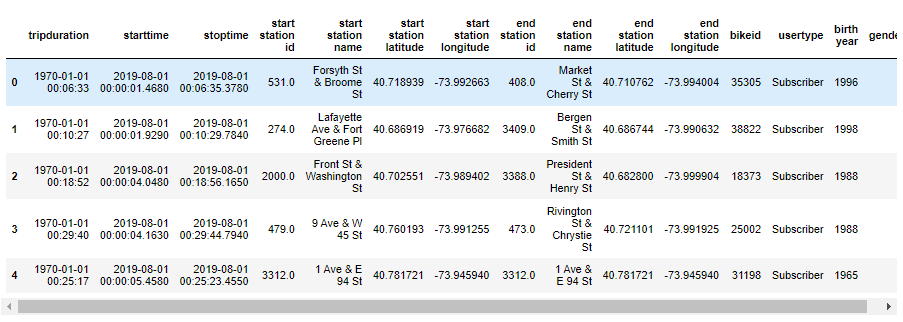
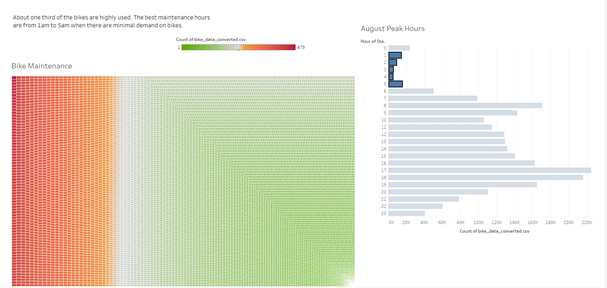

# bikesharing


## Overview of the analysis

This project is created to analyze New York bike sharing program Citi Bike in order to start similar company in Des Moines, Iowa. 


## Results

```none
[NYC Citi Bike Analysis](https://public.tableau.com/app/profile/oxana.drotieva/viz/NYC_CitiBike_Challenge_16443877634060/CitiBikeAnalysis?publish=yes)
```


The tripduration column's data type is changed from integer to datetime to get the time in hours and minutes using Pandas.




**Trip duration for all users.** Bikes are mostly used up to 30 minutes.


**Trip duration by gender.** Males use Citi Bike about 2.5 times more than females.


**Trips by weekday for each hour.** On weekdays most of the trips come to morning and evening hours while on weekends Citi Bike is more popular during the day.


**Trips by gender (weekday per hour)**. Again, males are more active users of Citi Bike than females. Users who don't share their gender mostly ride on weekends. Wednesdays afternoon is less popular time for biking among all three genders.


**User trips by gender by weekday.** 


**Bike maintenance analysis.** About one third of the bikes are highly used. The least busy hours are from 1am to 5am.




## Summary 

Based on the visualization analysis:

- Bikes are mostly used for up to 30 minutes
- Males use Citi Bike about 2.5 times more than females
- On weekdays most of the trips come to morning and evening hours while on weekends Citi Bike is more popular during the day
- Users who don't share their gender mostly ride on weekends. Wednesdays afternoon is less popular time for biking among all three genders
- About one third of the bikes are highly used. The least busy hours are from 1am to 5am which is the most convenient time for maintenance.


## Additional visualizations

**Bike usage by weekday and user type.** Subscribers mostly use Citi Bike on weekdays, especially on Thursdays and Fridays, while customers bike mostly on weekends. Also Citi Bike is used less on Wednesdays. 


**User type and gender most popular locations.** 

Inside the circled area is subscribers' most popular locations.


Female subscribers mostly use Citi Bike in this area


 While male subscribers are more spread out 


Customers bike mostly around Central Park and along the river.

